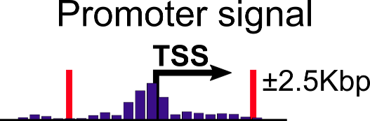
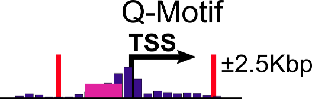

# Preparing input data for DRMN

The regulatory features could be context-specific or context independent. For context-independent features, we use motif networks, by finding instances of motifs in promoter regions of genes.


For context-specific features, we can aggregate regulatory signals (different histone modification, or chromatin accessibility).



Furthermore, we can aggregate chromatin accessibility signals (e.g. DNase/ATAC-seq) signal in motif instances.



We used [aggregateSignal](https://github.com/Roy-lab/aggregateSignal) to aggregate signal in promoter regions or motif instances. Briefly, we use bedtools to convert bam files to count files:
```
bedtools genomecov -ibam input.bam -bg -pc > output.counts
```
and aggregateSignal programs calculate coverage in input regions. See the [repository](https://github.com/Roy-lab/aggregateSignal) for more details on how to use the program.

Furthermore, for each feature, we log transform and quantile normalize the values across cell lines/time points. Additionally, we add cell line/time point specific suffixes to gene names in order (so gene names will be specific to a cell line while regulators will be the same for all cell lines). 

In the feature file, the first line is number of regulators and number of genes in the file (tab-delim).
The rest of the file will be in 3 columns format (tab-delim):
```
feature g_cell  value
```
